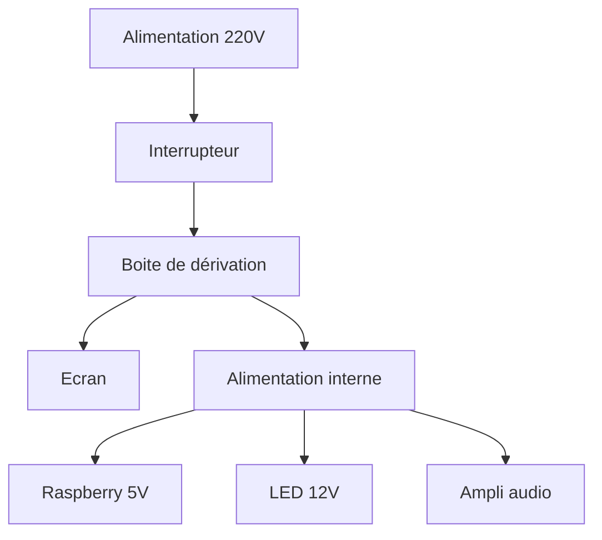

# Plans et composants utilisés pour construire ma borne d'arcade

## Introduction

La construction de la partie bois nécessite quelques outils (Scie circulaire, scie sauteuse, ponceuse, défonceuse, perceuse, visseuse, etc.) et un peu de savoir-faire.

Elle est facultative, et il est possible de commander un kit bois pour procéder uniquement à l'assemblage. A vous de voir en fonction de vos compétences, de votre motivation et de votre budget ce que vous préférez.

Je vais détailler ici la fabrication complète.

## Elements à prévoir

### Liste de courses

Certains éléments sont facultatifs en fonction de vos choix ou de ce que vous pouvez récupérer (les vieux écrans sont fréquents, et suffisent largement pour faire tourner des jeux d'arcade).

Les prix sont indiqués à titre indicatif, vérifiez dans votre région vous aurez peut-être de la chance ;)

J'ai indiqué certains liens vers des sites où vous pourrez trouver les pièces

Ma borne a été fabriquée à partir d'un raspberry pi 4 parce que j'en avais un, mais il est possible d'utiliser un mini PC (ou un PC de récup) pour faire tourner des jeux plus récents (pour pas forcément plus cher en cherchant bien sur le bon coin)

Le total des pièces se monte à 300€ environ.

| Désignation                                 | Qté | PU    | Total  | Commentaire                                                    | Exemple                                                                                                                                                                                                 |
|---------------------------------------------|-----|-------|--------|----------------------------------------------------------------|---------------------------------------------------------------------------------------------------------------------------------------------------------------------------------------------------------|
| Planche bois 600x2000 2p. 18                | 1   | 42    | 42     |                                                                |                                                                                                                                                                                                         |
| Vis bois 4x12 tête ronde                    | 8   |       | 0      | Pour la fixation joysticks                                             |                                                                                                                                                                                                         |
| Rondelle M4 larges                          | 8   |       | 0      | Pour la fixation joysticks                                             |                                                                                                                                                                                                         |
| Vis bois 2,5 x 12 tête fraisée              | 20  |       | 0      | Fixation ampli/HP/Alimentation/Carte contrôle                  |                                                                                                                                                                                                         |
| Plaque CP 10m 60x120 (2 fois 50x50 environ) | 1   | 17,9  | 17,9   | Fond et arrière                                                |                                                                                                                                                                                                         |
| Plaque PMMA 4mm 50x70 | 1   |   |    | Pour le marquee et le tour de l'écran             |                                                                                                                                                                                                         |
| Insert à frapper M8 (10 pcs)                | 1   | 2,43  | 2,43   |                                                                | [Lien](https://fr.aliexpress.com/item/33006298977.html?spm=a2g0o.productlist.main.35.26371e75qhWNgx&algo_pvid=a4dedc85-adc1-4375-8843-a4f57750feb1&algo_exp_id=a4dedc85-adc1-4375-8843-a4f57750feb1-17&pdp_ext_f=%7B%22order%22%3A%22260%22%2C%22eval%22%3A%221%22%7D&pdp_npi=4%40dis%21EUR%211.47%211.47%21%21%211.57%211.57%21%40211b80e117440515214711773e8cf2%2112000025676642055%21sea%21FR%211867511004%21X&curPageLogUid=rK2ELyBn2d7D&utparam-url=scene%3Asearch%7Cquery_from%3A) |
| 4 pieds à visser M8x25 ou M8x30             | 1   | 1,51  | 1,51   |                                                                | [Lien](https://www.amazon.fr/Meubles-Nivellement-R%C3%A9glage-Caoutchouc-R%C3%A9glables/dp/B07WQ2QZ3C)                                                                                                   |
| Haut Parleurs                               | 2   | 4,9   | 9,8    |                                                                | [Lien](https://fabulous-arcade.com/fr/hauts-parleurs/205-baffle-haut-parleur-arcade-10-cm-5-watts-8-ohms.html)                                                                                          |
| Amplificateur                               | 1   | 13,9  | 13,9   |                                                                | [Lien](https://fabulous-arcade.com/fr/amplificateurs/192-mini-amplificateur-arcade-21-stereo-basse-hi-fi-15-watts.html)                                                                                 |
| Alimentation 5V 3A min/12V 6A min           | 1   | 10,99 | 10,99  |                                                                | [Lien](https://fr.aliexpress.com/item/1005006091022617.html?spm=a2g0o.order_list.order_list_main.11.55385e5bAdzYTP&gatewayAdapt=glo2fra)                                                                |
| Cable alimentation C14 male                 | 2   | 2,5   | 5      | 1 pr écran + 1 pr borne                                        |                                                                                                                                                                                                         |
| Rallonge USB                                | 2   | 1,62  | 3,24   | Prise USB déportée en façade de la borne                       | [Lien](https://fr.aliexpress.com/item/1005004619614416.html?spm=a2g0o.order_list.order_list_main.5.55385e5bAdzYTP&gatewayAdapt=glo2fra)                                                                 |
| Interrupteur C14                            | 1   | 1,04  | 1,04   |                                                                | [Lien](https://fr.aliexpress.com/item/1005003475027266.html?spm=a2g0o.order_list.order_list_main.17.55385e5bAdzYTP&gatewayAdapt=glo2fra)                                                                |
| Cable HDMI                                  | 1   | 3     | 3      |                                                                |                                                                                                                                                                                                         |
| Boite derivation + wago + cable 2.5         |     |       |        | Pour alimentation écran + alim en sortie de l'interrupteur C14 |                                                                                                                                                                                                         |
| Raspberry pi 4                              | 1   | 50    | 50     |                                                                |                                                                                                                                                                                                         |
| Carte SD                                    | 1   | 10    | 10     |                                                                |                                                                                                                                                                                                         |
| Cable alim USB-C (ou micro USB si Rpi3)     | 1   | 2     | 2      |                                                                | [Lien](https://www.amazon.fr/dp/B0CLVC2KZL?ref=ppx_yo2ov_dt_b_fed_asin_title)                                                                                                                           |
| Mini PC                                     | 1   | 50    | 50     | Occasion ou récup                                              |                                                                                                                                                                                                         |
| Cable alimentation C14 male                 | 1   | 2,5   | 2,5    |                                                                |                                                                                                                                                                                                         |
| Écran 19" 4/3                               | 1   | 20    | 20     | À récupérer ou trouver sur le bon coin                         |                                                                                                                                                                                                         |
| Kit boutons / joysticks                     | 1   | 70    | 70     |                                                                |                                                                                                                                                                                                         |
| Vinyle décoration                           | 1   | 24,9  | 24,9   |                                                                | [Lien](https://fabulous-arcade.com/fr/vinyles/2754-115864-vinyle-bartop-fabulous-arcade-classic-retro.html#/lamination-sans/nombre_de_boutons_par_joueur-6_boutons/version-19_pouces)                   |
| T-Molding 18mm 6m                           | 1   | 14,4  | 14,4   |                                                                | [Lien](https://fabulous-arcade.com/fr/configurateur-old/347-t-molding-noir-6-metres-pour-borne-classic.html)                                                                                            |
| Cable haut parleur                          |     |       |        | À récupérer pour cable alimentation 5V / 12V et HP             |                                                                                                                                                                                                         |
| Support collier serrage à imprimer          |     |       |        |                                                                | [Lien](https://www.thingiverse.com/thing:3010768)                                                                                                                                                       |
| Collier de serrage                          |     |       |        |                                                                |                                                                                                                                                                                                         |
| Bandeau LED                                 |     |       |        |  Facultatif, peut se placer derrière le sticker sur le "marquee"                                                              |                                                                                                                                                                                                         |
| Gaine thermo (cable organization)           |     |       |        |                                                                |                                                                                                                                                                                                         |

### Consommables

En plus des éléments, vous aurez besoin de certains consommables

* Colle à bois, goujons, vis (selon le mode d'assemblage bois choisi)
* papier de verre (80/120/180)
* Mèche à bois d28
* Mèche à bois d25
* Fraise à copier
* Fraise à rainurer d2.5 (pour installer le T-Molding)
* Pinceau
* Peinture (pour les bords si pas de T-Molding)
* Vernis (pour l'accroche des stickers vinyls)

## Fabrication de la caisse

### Découpe des côtés
Pas la plus simple, mais en prenant son temps ca se fait bien.

Tracer le plan des deux côtés sur la planche de bois, découper à la scie sauteuse en conservant un peu de marge.

Finalisez ensuite les découpes
* soit à l'aide d'un gabarit et d'une fraise à copier
* soit à l'aide de limes et de papier de verre,

Une fois le premier côté terminé, utilisez le comme gabarit pour le second côté.
Là encore, si vous n'avez pas de fraise à copier, utilisez des limes et du papier de verre.

Il est très important que les deux côtés soient strictement identiques, sans quoi votre borne ne sera jamais droite.

### Découpe des autres éléments

Les autres éléments sont plus simples à découper, ce sont basiquement des rectangles.
Suivre les plans fournis, en faisant attention de bien découper des rectangles (côtés // et angles à 90°)

### Perçage des boutons

Concernant le perçage des boutons, la précision est de rigueur.
Personnellement, je me suis basé sur les stickers pour positionner les boutons au bon endroit. Dérouler le sticker à sa future place sans le coller, repérer les centres des cercles (une impression de cercle à la bonne dimension avec une croix au centre peut aider), et marquer le centre avec un pointeau à travers le sticker.
Une fois les centres marqués, et en fonction de vos boutons, 1 ou 2 perçages seront nécessaires. Avec mes boutons, un premier perçage à 28 sur 4mm de profond suivi d'un perçage à 25 sur le reste de l'épaisseur de la planche.

A répéter pour tous les boutons (concernant le joystick, un perçage à 25 a suffit).

## Installation de l'écran

Fabriquer un support VESA composé d'une planche de bois que l'on viendra visser sur 2 support collés à l'intérieur des 2 côtés de la borne.
Une fois le support VESA réalisé et vissé à l'écran, mesurer l'épaisseur complète écran+support pour venir positionner les support sur les côtés, et les coller en place.
Une fois bien sec, venir visser le support d'écran en place.

Il est possible (et recommandé) de venir peindre à la bombe le tour de l'écran en noir, afin de le rendre discret dans la borne terminée.

## Raccordement de l'amplificateur

L'amplificateur doit être raccordé à l'alimentation (12V dans mon cas, vérifiez les caractéristiques du votre).
J'ai ensuite soudés 2 cables audio sur les Haut parleurs, et raccordé ces cables à l'amplificateur. 

Un trou en façade du panneau inférieur permet le réglage du volume, et l'amplificateur est vissé à une petite plaque de CP elle-même vissée à une équerre sur le panneau intérieur.

Pour terminer, raccorder via une prise jack l'amplificateur au raspberry.

## Raccordement electrique

La sortie de l'interrupteur est ramené dans une boite de dérivation pour alimenter par la suite l'écran (via un cable C14 que l'on aura coupé) et l'alimentation.

L'alimentation est simplement raccordée en entrée sur la sortie de la boite de dérivation, de manière classique (Neutre, Phase, Terre).

Les sorties 12V et 5V alimentation respectivement le duo LED/Amplificateur et le rapsberry (si vous avez opté pour un miniPC, il sera alimenté en 220V, et le 5V devient inutile)

## Raccordement des boutons

Le branchement des boutons est facile, mais nécessite un peu de rigueur si vous ne voulez pas vous retrouver avec un sac de noeuds.
Repérer chaque cable et brancher le sur la carte de commande (je vous conseille de passer 2 ou 3 morceaux de gaine thermorétractable sur les cables d'un joystick pour les rassembler et les empêcher de s'emmêler)

## Installation de l'OS

L'OS choisi est Batocera. Il est disponible ici : https://batocera.org/

Pour l'installer, récupérez l'archive correspondante à votre matériel sur le site officiel (https://batocera.org/download), et suivez les guides dispos sur le même site officiel. 

Il est fourni de base avec quelques jeux qui vous permettront de valider que tout fonctionne correctement.