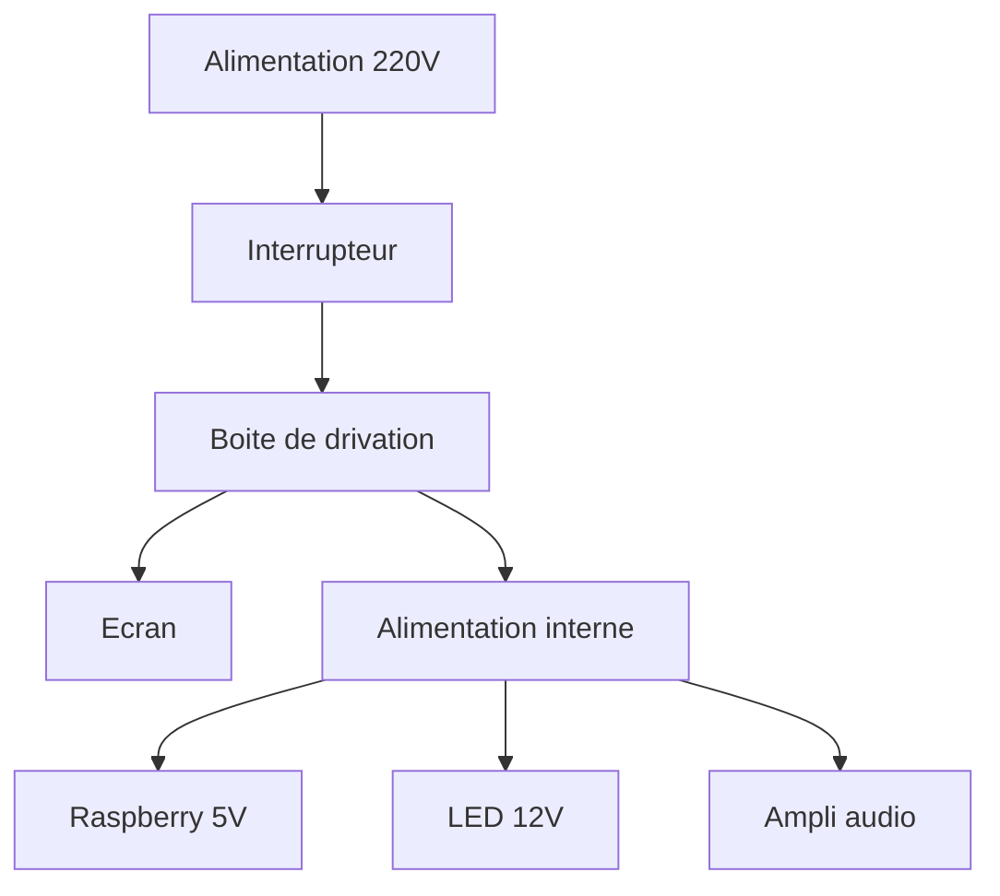

# Schema de cablage électrique

```mermaid
graph TD;
    P[Alimentation 220V] --> I[Interrupteur] --> D[Boite de drivation]
    D --> E[Ecran]
    D --> AI[Alimentation interne]
    AI --> R[Raspberry 5V] 
    AI --> L[LED 12V]
    AI --> A[Ampli audio]
```
